# **Bedtime Stories**

## **Introduction**

The [Bedtime Stories](https://github.com/DaSHdotHub/BedtimeStories) website is a page for parents and children alike.
As long as someone can read, he or she should be encouraged to visit to check for new or classic short stories.

One of the key concepts of this website is to showcase cherished short stories from our childhood, creating an immersive experience beyond plain black text on a white background.

### **Motivation**

One of the things I do most regularly is read a goodnight story to my son. As marvelous as books are, there are times when it's not possible to bring them along on a trip. A website like [Bedtime Stories, deployed on GitHub pages](https://dashdothub.github.io/BedtimeStories/) 
charms readers with its simplicity and old-fashioned retro styling.

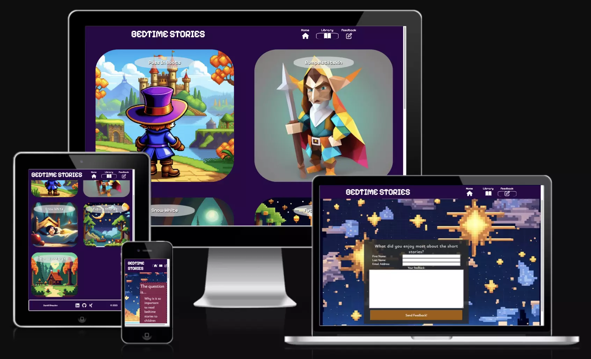

## **Table of Contents**

## [**Introduction**](#introduction-aa)

- [**Motivation**](#motivation-aa)

## [**Features**](#features)

- [**Preview mobile**](#preview-mobile)

- [**Preview desktop**](#preview-desktop)

- [**Responsive Desgin Elements**](#responsive-design)

- [**Future Features**](#future-features)

## [**Design Principles**](#design-principles)

- [**Fonts**](#fonts)

- [**Coloring**](#coloring)

## [**Technologies, Libraries & Sources**](#technologies-libraries--sources)

- [**Technologies**](#technologies)
  
- [**Libraries & Sources**](#libraries--sources)
  
- [**IDE**](#ide)

### [**Testing & Quality Control**](#quality-control-aa)

- [**W3C Validator - HTML**](#w3c-html-validator)

- [**W3C Validator - CSS**](#w3c-csee-validator)

- [**Lighthouse report - mobile**](#lighthouse---mobile)

- [**Lighthouse report - desktop**](#lighthouse---desktop)

### [**Deployment and local development**](#deployment-and-local-development-aa)

- [GitHub Pages](#github-pages)
- [Forking the GitHub Repository](#forking-the-github-repository)

### [**Credits**](#credits-aa)

- [Content](#content)
- [Media](#media)

## Features

### **Responsive Design**
This project was developed in a *mobile first* approach, later on designs were changed to deliver a complete user experience for mobile as well as for larger devices, like tablets and desktop computers.

#### **Preview mobile**

  To enlarge the 'preview for mobile' either *pinch to zoom* on mobile devices or use the zoom feature from your browser, e.g. [CTRL+Scroll on most windows machines].

  | Index.html                                                | Library.html                                                  | Overlay in Library.html                                                          | Feedback.html                                                   |
  | --------------------------------------------------------- | ------------------------------------------------------------- | -------------------------------------------------------------------------------- | --------------------------------------------------------------- |
  | 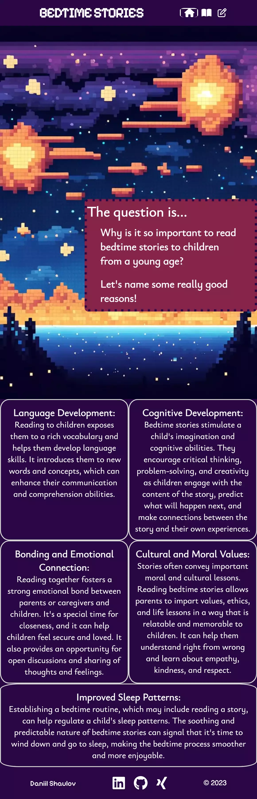 | 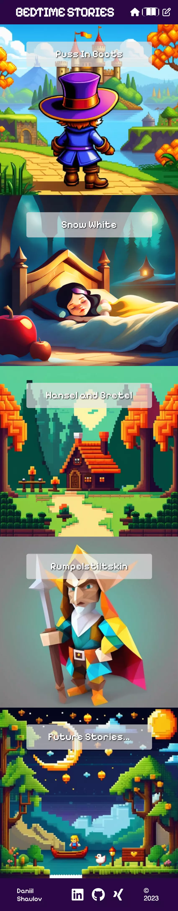 | 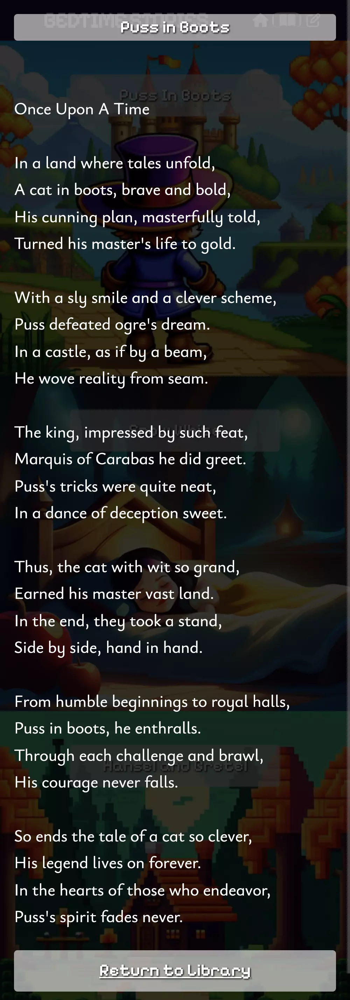 | 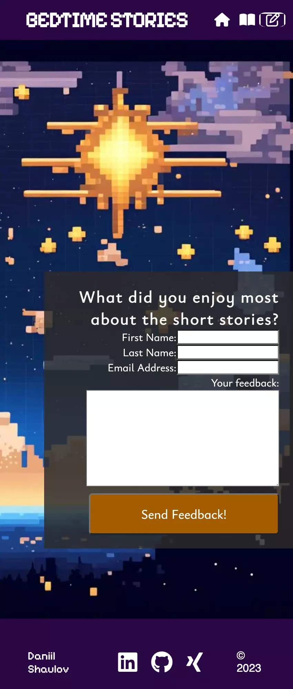 |

#### **Preview desktop**

In the following the desktop presentation is shown of each page, clicking on one or all of the pane elements will display the content behind it.

Index.html

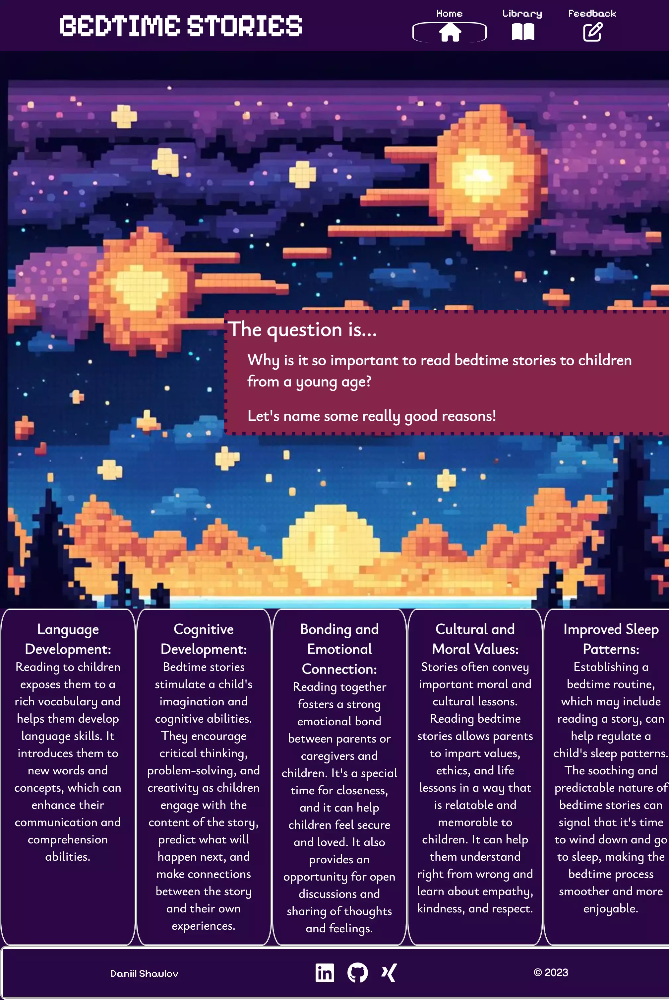

Libraray.html

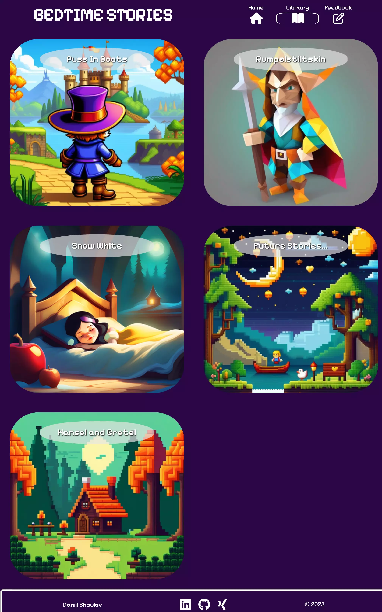

Overlay in Libraray.html

Feedback.html

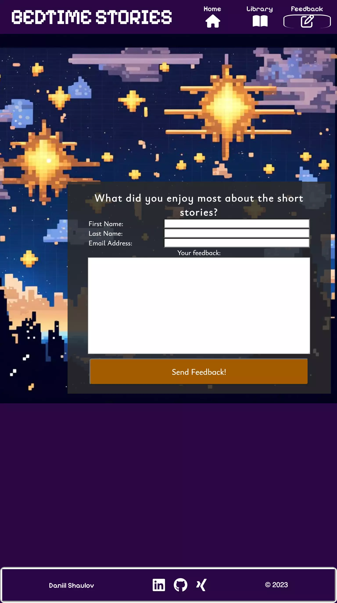

### **Responsive Design Elements**

#### **Header**

- On smaller devices, the header shows the logo and three symbols for navigation. This changes on larger screens, where labels are also shown for convenience. 
  
  
- The active page is circled on the intended navigation symbol.
- Design Language - Intuitive icons represent the expected interaction: 
  - 'Home' for the *main* page
  - 'Openend book' for the *library*
  - 'Pen on note' for *feedback*

#### **Footer**

- On smaller devices the footer is very consistent with the whole design of the complete webpage.
- This changes for bigger screens as the footer gets framed to attract more attention.  

- On desktop devices where you would hover with a mouse over the *Social Network* icons, they will enlarge to attract even more attention.

#### **Index.html**

  As can be seen above in the preview section from mobile and desktop the *index.html* does slightly differ depending on the screensize maintaining a good visibility and readability without the need to scroll horizontal.
  
  The *interruption element* also changes it's size and placement on the background depending on the screen size, though always maintaining the element does not attend to much attention and visually blocking the background image.

#### **Library.html**

  The difference can be seen quite clearly in the preview section. Where on mobile the user will experience a seamless sequence of images, desktop devices or rather *bigger* screens will show a two column gallery approach where each image reminds the user unintentionally of an *app*-like structure.

#### **Overlay in Library.html**

  Almost identical between mobile and desktop, with the exception of the alignment of the content. On mobile it is left alligend for better readability where on desktop size the allignment is centered for better use of the visual space.

#### **Feedback.html**
  
  The sole difference between mobile and desktop is the size of the input fields and the text-alignment to make the most use of the given space.

### **Future Features (not currently planned)**

- Add more short stories to the library.
- Add "reading out" feature
- Gather Feedback and actually send it to an address where it gets processed

## Design principles

- Creating immersion through background colouring
- Gamification through using special fonts like Pixelify and underlining it with corresponding *pixeled* background images.

### **Fonts**

* Ysabeau Infant  

      A serif font which was used in this project for displaying text's and paragraph elemnts. Also used for the short stories. You would find a serif font rather often in printed out fairy-tales.

* Pixelify Sans  

      This 'special' is used for the enhancement of the *gamification* feeling, headings, header and footer do contain this font. Also this font was used for the headings seen on the covers on the library page.

### **Coloring**

| Theme coloring                                                  | Font colorining                                               | Interruption El.                              | Button coloring                                                                     |
| --------------------------------------------------------------- | ------------------------------------------------------------- | --------------------------------------------- | ----------------------------------------------------------------------------------- |
| 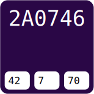 |  | 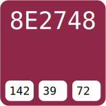 | 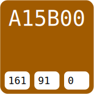 |

## Technologies, Libraries & Sources
In this section, we detail the technologies, libraries, and sources used in the project.

### **Technologies**

- [HTML5](https://en.wikipedia.org/wiki/HTML5)
- [CSS3](https://en.wikipedia.org/wiki/CSS)

### **Libraries & Sources**

- [Git](https://git-scm.com/) - For version control.
- [GitHub](https://github.com/) - Deployment of the website and storing the files online.
- [Google Fonts](https://fonts.google.com/) - Imported main fonts for the website.
- [Am I Responsive](https://ui.dev/amiresponsive) - Mockup responsive image for the README file.
- [Python3 template from CI](https://github.com/Code-Institute-Org/ci-full-template) - Python3 based template from 'Code Institute' for easier deployment.

### **IDE**

- [Codeanywhere](https://codeanywhere.com/signin) - Cloud IDE, was abandoned due to performance reasons in favour to
- [VS-code for Mac](https://code.visualstudio.com/download) - Local IDE

## **Quality Control**

W3C HTML Validator, W3C CSS Validator, and Dev-Tools Lighthouse were used for quality control.

### **W3C HTML Validator**

Results - W3C HTML Validator

No Errors found. <strong>Index.html</strong>

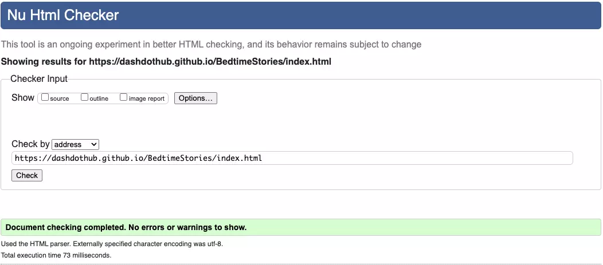

No Errors found. <strong>Library.html</strong>

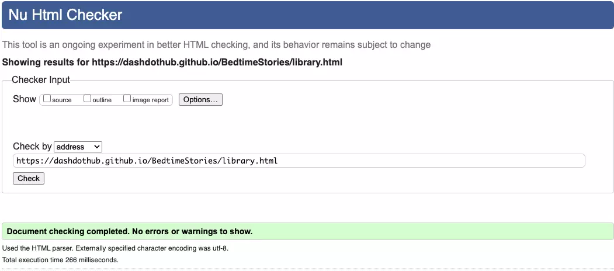

No Errors found. <strong>Feedback.html</strong>

### **W3C CSS Validator**

Results - W3C CSS Validaor

No Errors found

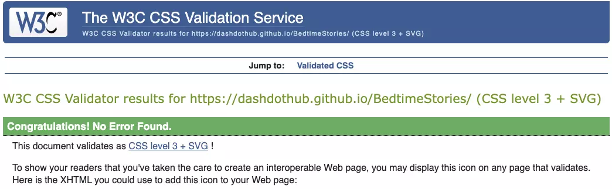

### **Lighthouse - mobile**

Results - Dev-Tools Lighthouse - mobile

<strong>Overall good results can for mobile be seen</strong>

<strong>For Index.html</strong>

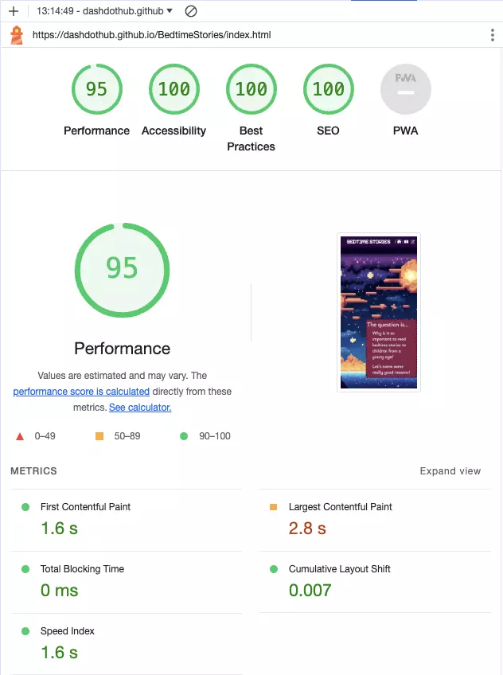

<strong>For Library.html</strong>

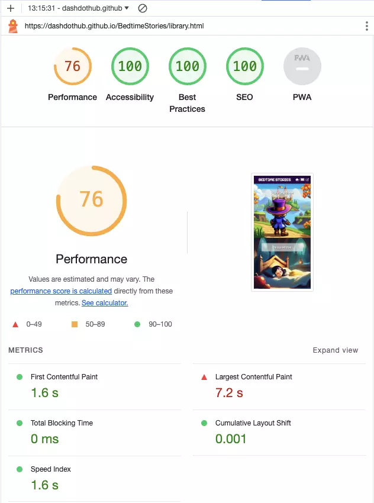

<strong>For Library.html</strong> after low resolution covers were added for mobile devices with a screen width smaller than 480px.

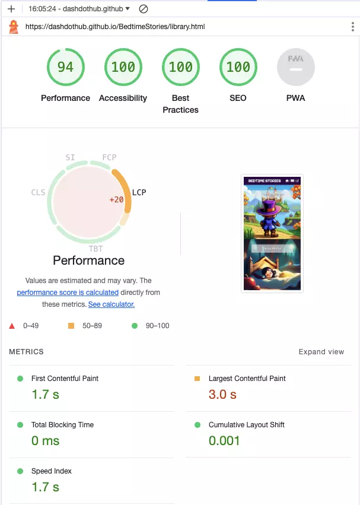

<strong>For Feedback.html</strong>

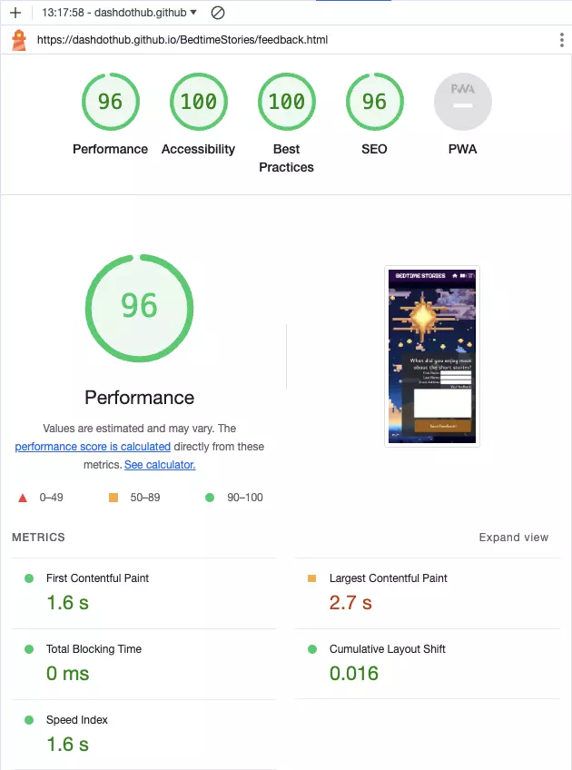

### **Lighthouse - desktop**

Results - Dev-Tools Lighthouse - desktop

<strong>Overall good results can for mobile be seen</strong>

<strong>For Index.html</strong>

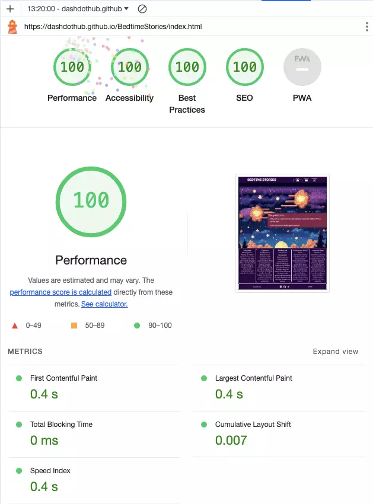

<strong>For Library.html</strong>

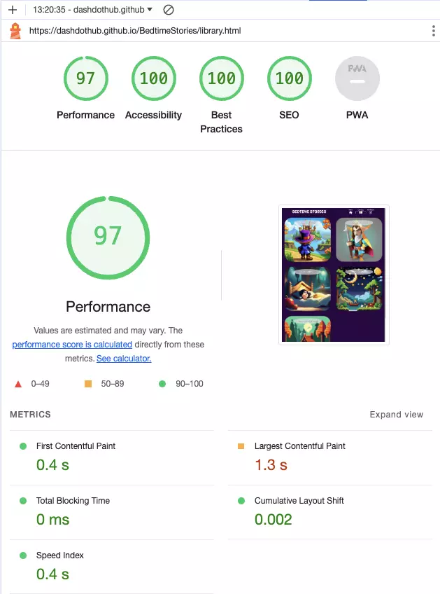

<strong>For Feedback.html</strong>

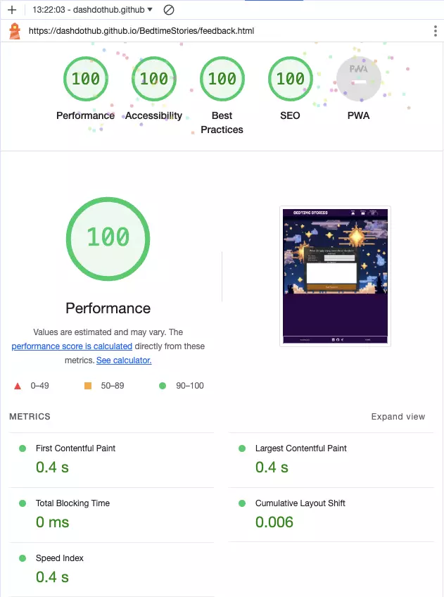

## **Deployment and local development**

### **GitHub Pages**

To deploy the project on GitHub Pages...

1. Log in to GitHub and locate [GitHub Repository Bedtime Stories](https://github.com/DaSHdotHub/BedtimeStories)
2. At the navigation bar of the repository tab find "Settings", click.
3. At the left side under the "Code and automation" section, click on "Pages".
4. Next locate the "Source" and set it to "Deploy from a branch", branch should be "main", folder set to "root" and then click on the "Save" button.
5. Head back to the [Project Repository](https://github.com/DaSHdotHub/BedtimeStories) and on the right side click on [Deployments](https://github.com/DaSHdotHub/BedtimeStories/deployments) and under the "Active deployments" section is the freshly deployed project: [Bedtime Stories](https://github.com/DaSHdotHub/BedtimeStories)

### **Forking the GitHub Repository**

By forking the GitHub Repository we can make a copy of the original repository to view or make changes without changing the original repository.

For forking the GitHub Repository...

1. Log in to GitHub and locate [GitHub Repository Bedtime Stories](https://github.com/DaSHdotHub/BedtimeStories)
2. At the top, in the line with the project's name, on the right side find "Fork", click.
3. Now you have a copy of the original repository in your GitHub account.

### **Local run**

To run the project locally...

- Make sure python3 is installed. 
- Inside or outside an IDE run following command from the root directory of the project: 
  <code>python3 -m http.server</code>

## **Credits**

Special thanks to my wife and child for their unwavering support. :-)

### **Content**

- Some design patterns were inspired by [Love Running](https://github.com/DaSHdotHub/Love-Runnin-on-CI-Template) project.
- Short stories were artificially generated with the help of ChatGPT v4, see following example

Rhyme for *Snow White*, extract from the chat with ChatGPT

### **Media**

- Images used as cover pictures were artificially generated from from: [StableDiffusion](https://stablediffusion.com/).
- Images used for background styling were artificially generated from: [NightCafe](https://nightcafe.com/).
- Resizing and converting images: [Simple Image Resizer](https://www.simpleimageresizer.com)
- All Icons except the favicon were taken from [FontAwesome](https://fontawesome.com/.)
- The FavIcon was chosen from [FlatIcon](https://www.flaticon.com/free-icons/storytelling)
- Creating Responsive Mock [UI.dev](https://ui.dev/amiresponsive)
- Color panes for this documentation [Encycolorpedia](https://encycolorpedia.com/)