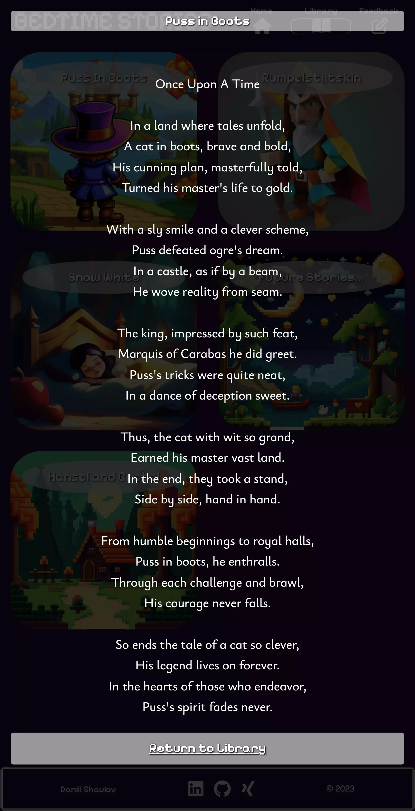
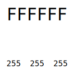

# **Bedtime Stories**

## **Introduction**

The [Bedtime Stories](https://github.com/DaSHdotHub/BedtimeStories) website is a page for parents and children alike.
As long as someone can read he or she should be encouraged to visit to check for new or
old, rather classic short stories.

One of the key concepts of this website should be to sample some of these short
stories we all so cherish and love from our childhood. Create an immersion which
goes beyond plain black text on white background.

### **Motivation**

One of the thing I do most on a regulary basis is reading a good night story to my son.
As marvelous as books are, sometimes there is no possibilty to bring them along on a
longer trip. A website like [Bedtime Stories - deployed on GitHub pages -](https://dashdothub.github.io/BedtimeStories/) is
charming to the reader through sheer simplicity and old fashioned retro styling.

## **Table of Content**

### [**Introduction**](#introduction-aa)

#### [**Motivation**](#motivation-aa)

## [**Features**](#features)

- [**Preview mobile**](#preview-mobile)

- [**Preview desktop**](#preview-desktop)

- [**Responsive Desgin Elements**](#responsive-design)

- [**Future Features**](#future-features)

## [**Design Principles**](#design-principles)

- [**Fonts**](#fonts)

- [**Coloring**](#coloring)

## [**Technologies, Libraries & Sources**](#technologiy-aa)

## [**Responsive Design and Preview**](#responsive_design-aa)

- [Header](#header)
- [Preview](#preview)
- [IAmResponsive](#I-am-responsive)

### [**Quality Control**](#quality-control-aa)

### [**Testing**](#testing-aa)

### [**Deployment and local development**](#deployment-and-local-development-aa)

- [GitHub Pages](#github-pages)
- [Forking the GitHub Repository](#forking-the-github-repository)

### [**Credits**](#credits-aa)

- [Content](#content)
- [Media](#media)

## Features

### **Responsive Design**

#### **Preview mobile**

  | Index.html                                                | Library.html                                                  | Overlay in Library.html                                                          | Feedback.html                                                   |
  | --------------------------------------------------------- | ------------------------------------------------------------- | -------------------------------------------------------------------------------- | --------------------------------------------------------------- |
  |  |  |  |  |

#### **Preview desktop**

In the following the desktop presentation is shown of each page, clicking on one or all of the pane elements will display the content behind it.

Index.html

Libraray.html

Overlay in Libraray.html

Feedback.html

### **Responsive Desgin Elements**

#### **Header**

- On smaller devices the header will show the Logo and only three small symbols for navigation. This changes however when a bigger screen is present, the labels are than also shown for convinience. 
  
  
- The active page is circled on the intended navigation symbol.
- Design-Language, inuitive approach. The icons as shown do represent the interaction the user can expect.
  - 'Home' icon for the *main* page or *homepage*
  - 'Openend book' icon for the *library*
  - 'Pen on note' icon for suggesting to leave user input, in this case *feedback*

#### **Footer**

- On smaller devices the footer is very consistent with the whole design of the complete webpage.
- This changes for bigger screens as the footer gets framed to attract more attention.  

- On desktop devices where you would hover with a mouse over the *Social Network* icons, they will enlarge to attract even more attention.

#### **Index.html**

  As can be seen above in the preview section from mobile and desktop the *index.html* does slightly differ depending on the screensize maintaining a good visibility and readability without the need to scroll horizontal.
  
  The *interruption element* also changes it's size and placement on the background depending on the screen size, though always maintaining the element does not attend to much attention and visually blocking the background image.

#### **Library.html**

  The difference can be seen quite clearly in the preview section. Where on mobile the user will experience a seamless sequence of images, desktop devices or rather *bigger* screens will show a two column gallery approach where each image reminds the user unintentionally of an *app*-like structure.

#### **Overlay in Library.html**

  Almost identical between mobile and desktop, with the exception of the alignment of the content. On mobile it is left alligend for better readability where on desktop size the allignment is centered for better use of the visual space.

#### **Feedback.html**
  
  The sole difference between mobile and desktop is the size of the input fields and the text-alignment to make the most use of the given space.

### **Future Features (not planned)**

- Add more short stories to the library.
- Add "reading out" feature
- Gather Feedback and actually send it to an address where it gets processed

## Design principles

- Creating immersion through background colouring
- Gamification through using special fonts like Pixelify and underlining it with corresponding *pixeled* background images.

### **Fonts**

* Ysabeau Infant  

      A serif font which was used in this project for displaying text's and paragraph elemnts. Also used for the short stories. You would find a serif font rather often in printed out fairy-tales.

* Pixelify Sans  

      This 'special' is used for the enhancement of the *gamification* feeling, headings, header and footer do contain this font. Also this font was used for the headings seen on the covers on the library page.

### **Coloring**

| Theme coloring                                                  | Font colorining                                               | Interruption El.                              | Button coloring                                                                     |
| --------------------------------------------------------------- | ------------------------------------------------------------- | --------------------------------------------- | ----------------------------------------------------------------------------------- |
|  |  |  |  |

## Technologies, Libraries & Sources

### **Technologies**

- [HTML5](https://en.wikipedia.org/wiki/HTML5)
- [CSS3](https://en.wikipedia.org/wiki/CSS)

### **Libraries & Sources**

- [Git](https://git-scm.com/) - For version control.
- [GitHub](https://github.com/) - Deployment of the website and storing the files online.
- [Google Fonts](https://fonts.google.com/) - Imported main fonts for the website.
- [Am I Responsive](https://ui.dev/amiresponsive) - Mockup responsive image for the README file.

### **Preview**

- **Mobile Phone**
  

  
index.html
  

  
  

  

  
library.html
  

  
  

  

  
feedback.html
  

  
  

## **Quality Control**

- W3C HTML Validator
- W3C CSS Validaor
- Dev-Tools Lighthouse

## **Technology**

In this project following technologies and tools were used:

- GitHub as 'Code Repository' and for version control
- Git for packaging and comittinng the code
- HTML5
- CSS3
- Codeanywhere as IDE
- Python3 template from CI
- Am I Resonsive for creating some mockup images for this documentation

## **Deployment and local development**

### **GitHub Pages**

1. Log in to GitHub and locate [GitHub Repository Bedtime Stories](https://github.com/DaSHdotHub/BedtimeStories)
2. At the navigation bar of the repository tab find "Settings", click.
3. At the left side under the "Code and automation" section, click on "Pages".
4. Next locate the "Source" and set it to "Deploy from a branch", branch should be "main", folder set to "root" and then click on the "Save" button.
5. Head back to the [Project Repository](https://github.com/DaSHdotHub/BedtimeStories) and on the right side click on [Deployments](https://github.com/DaSHdotHub/BedtimeStories/deployments) and under the "Active deployments" section is the freshly deployed project: [Bedtime Stories](https://github.com/DaSHdotHub/BedtimeStories)

### **Forking the GitHub Repository**

By forking the GitHub Repository we can make a copy of the original repository to view or make changes without changing the original repository.

1. Log in to GitHub and locate [GitHub Repository Bedtime Stories](https://github.com/DaSHdotHub/BedtimeStories)
2. At the top, in the line with the project's name, on the right side find "Fork", click.
3. Now you have a copy of the original repository in your GitHub account.

### **Local run**

- Make sure python3 is installed. 
- Inside or outside an IDE run following command from the root directory of the project: 
  <code>python3 -m http.server</code>

## **Credits**

- Big thanks to my wife and my child who are always supporting me at their best :-)

### **Content**

- Some design patterns were inspired by [Love Running](https://github.com/DaSHdotHub/Love-Runnin-on-CI-Template) project.
- 8bit retro theming is just a personal thing.

### **Media**

- Images used as cover pictures were artificially generated from from: [StableDiffusion](https://stablediffusion.com/).
- Images used for background styling were artificially generated from: [NightCafe](https://nightcafe.com/).
- Resizing and converting images: [Simple Image Resizer](https://www.simpleimageresizer.com)
- All Icons except the favicon were taken from [FontAwesome](https://fontawesome.com/.)
- The FavIcon was chosen from [FlatIcon](https://www.flaticon.com/free-icons/storytelling)
- Creating Responsive Mock [UI.dev](https://ui.dev/amiresponsive)
- Color panes for this documentation [Encycolorpedia](https://encycolorpedia.com/)